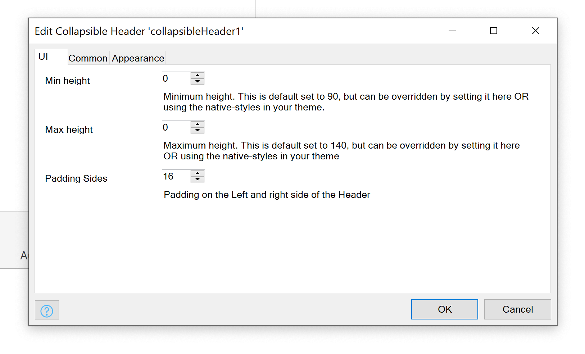
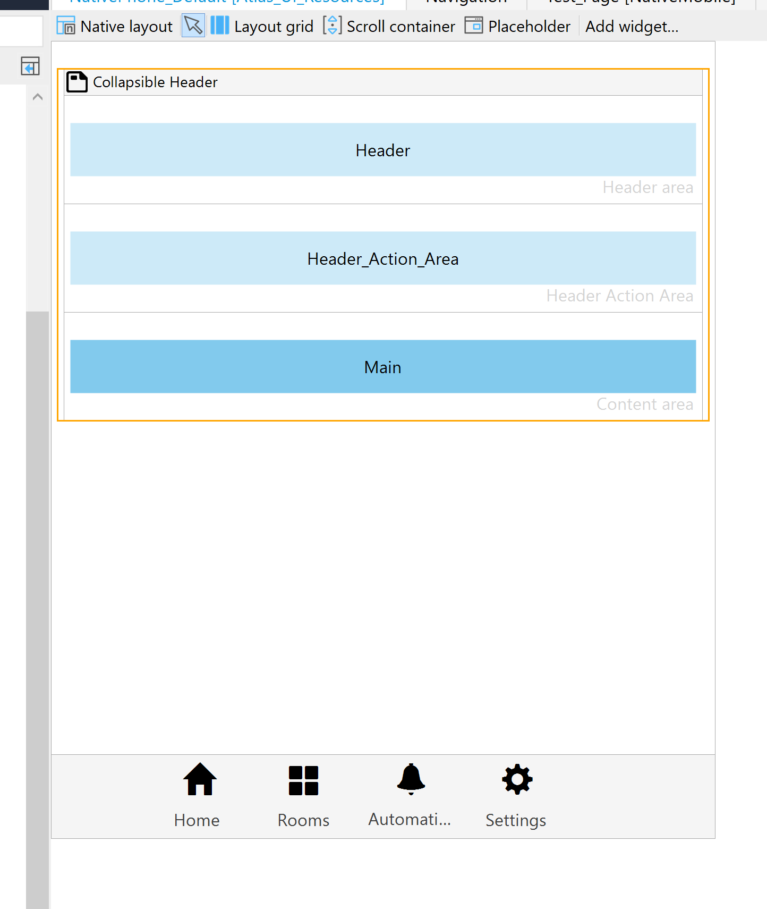
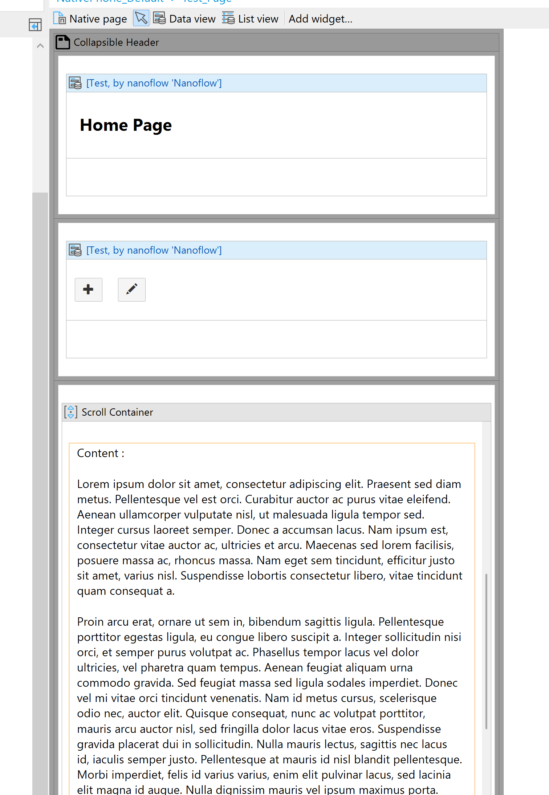

<p align="center">
    
    <br>
    <br>
   A Collapsible Header for Mendix Native
    <br>
    <br>
  <a href="">
    
  </a>
  <a href="">
    
  </a>
  <a href="">
    
  </a>
  <a href="https://appstore.home.mendix.com/link/modeler/">
    
  </a>
  <a href="https://docs.mendix.com/developerportal/app-store/app-store-content-support">
    
  </a>
  <a href="/LICENSE">
    
  </a>
  <br>

</p>
<p >
<h3>Introduction</h3>

This widget was developed to follow a very specific Design Pattern, and was made for apps that use the Mendix Design
System.

The header follows a "2 Row to 1 Row" principal. When the header is expanded there are 2 Rows. The first row with System
Back Button if available, the second row is the Page Title and Developer Defined Actions Buttons (max 2). On Scroll the
header collapses based on the scroll index of the ScrollView. This will trigger the Title to scale down and move on the
x and y axis. The Page title and action buttons will now be inline with the Back button.

<h3>Let Op! | Things to Note</h3>

The widget should work as Long as Mendix Native uses ReactNavigation 4.

The Widget gets the Page title from the Page Property `General>Title`

The Max Length for Titles are 2 Lines if **NO** Back button and 1 If there is.

<h3>Data</h3>

<p>

</p>

| Name                 | Type      | Desc.                                                                                                                         |
| -------------------- | --------- | ----------------------------------------------------------------------------------------------------------------------------- |
| Color of Header Text | `string`  | Color of Back button and Text                                                                                                 |
| Header Font Size     | `integer` | Font Size of Header Text Expanded (Best Not Changed)                                                                          |
| Collapsed Font Size  | `integer` | Font Size of Header Text Collapsed (Best Not Changed)                                                                         |
| Back Button Size     | `integer` | Font Size of Back Button (Best Not Changed)                                                                                   |
| Min height           | `integer` | Minimum height. This is default set to 90, but can be overridden by setting it here OR using the native-styles in your theme. |  |
| Max height           | `integer` | Maximum height. This is default set to 140, but can be overridden by setting it here OR using the native-styles in your theme |  |
| Padding Sides        | `integer` | Padding on the Left and right side of the Header                                                                              |  |

<p >
<h3>Usage</h3>
 
 
</p>
Add this code to your natives Styles

```js
export const mendix_collapsibleheader_CollapsibleHeader = {
    header: {
        backgroundColor: "#0A1325F0",
        minHeight: 90, // Min height
        maxHeight: 140 // Max Height
    }
};
```

## Issues || Track Features

-   Long Titles break overflow

Add issues to
[project](https://github.com/ahwelgemoed/collapsible-native-header-widget/projects/1?add_cards_query=is%3Aopen) board or
open an GH [issue](https://github.com/ahwelgemoed/collapsible-native-header-widget/issues/new).
