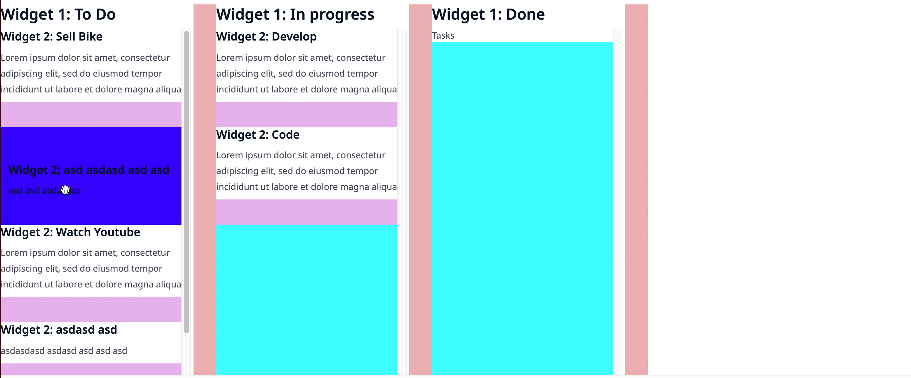

# DND Widget

`json` delivered to Mendix

```ts
export type OnDropTypes = {
    index: number;
    draggedUUID: string;
    droppedOnUUID: string;
    currentParentUUID: string;
    droppedOnParentUUID: string;
};
```

## Styling

The widget exposes a lot of class names that you can target for custom styling

**Note:** Pseudo styling, like `:hover`, is not recommended and could lead to some issues.

The widget is wrapped with the class name given in `Unique Container Name` looking something like this:

```html
<!-- some cool HTML -->
<div class="TEXT_FROM_Unique_Container_Name">
    <Widget />
</div>
```

### Generic and Specific Styles

So all css is encapsulated, but if you wanted to write universal styles for 2 or more Widgets, the widget exposes
generic and specific class names: e.g.

```html
<!-- some cool HTML -->
<Widget>
    <div
        class="TEXT_FROM_Unique_Container_Name_dnd_draggable_item
        dnd_draggable_item"
    >
        Drag Me
    </div>
</Widget>
```

So for every class name there is a generic one and specific one prefixed with `Unique Container Name`

### Odd and Even Class Names

As the widget adds and removes class names for all interactions with it it gives odd and even class names.

If there is a class name `draggable` there is a `_not_draggable`. Below is the list of css names on a Draggable element
that is in rest:

```text
Unique_Container_Name_dnd_draggable_item
dnd_draggable_item

Unique_Container_Name__dnd_draggable_not_new // not recommended
dnd_draggable_not_new // not recommended

Unique_Container_Name__dnd_draggable_not_over
dnd_draggable_not_over

Unique_Container_Name__dnd_draggable_not_hover
dnd_draggable_not_hover

Unique_Container_Name__dnd_draggable_not_dragging
dnd_draggable_not_dragging
```

### Special Class names

There is a droppable area at bottom of the widget that takes up the height by its parent/ or the whole empty widget.
This is done for if you want a droppable region bigger that the list is long:

**NOTE** Use with caution as it will always return -1 index. So id you get -1 in you mendix microflow, know that that
dropped item must be added to the bottom of the list

```text
Unique_Container_dnd_draggable_container_droppable
dnd_draggable_container_droppable
```

At the bottom of every iteration in the list there is an empty `div` what can be styles as a spacer, this can be margin,
padding or height/width.

```text
Unique_Container_dnd_draggable_container_not_dragging
dnd_draggable_container_not_dragging

Unique_Container_dnd_draggable_container_dragging
dnd_draggable_container_dragging
```

### Drag Preview

Drag preview has most of the same classnames as the individual items rendered except it is nested a lithe different so
be cause's when it come to nesting/specificity.

-   Drag Preview Container

```text
Unique_Container_dnd_drag_preview_container
dnd_drag_preview_container
```

-   Drag Preview Item

```text
Unique_Container_dnd_draggable_item
dnd_draggable_item

Unique_Container_dnd_drag_preview_item
dnd_drag_preview_item
```

### Still ToDo

-   Drag preview on nested drag items

-   Hover effects for nested items

Set width on Parent and try not to set it on children

## Some oddities when nesting.

As nesting can cause oddities, and the functionality does depend on on the way you style it.

So lets see some practical examples

Note - We are using the Swimlane and Story Example again.

### The Setup in Mendix

<table>
  <tr>
    <th>Swimlane Widget</th>
    <th>Story Widget</th>
  </tr>

  <tr>
    <td>
    
    </td>
    <td>
    
    </td>
  </tr>
</table>

**Hover Event**

```scss
//  Mouse Hover Over Item
.STORY_dnd_draggable_hover {
    background-color: rgba(61, 208, 120, 0.399); // Light Green
}
```


```scss
//  Space Created Above on Drag Over
.isAbove {
    background-color: blue;
}
//  Space Created Below on Drag Over
.isBelow {
    background-color: red;
}
```



**Dragging Event**

```scss
.STORY_dnd_draggable_dragging {
    background-color: rgba(208, 154, 61, 0.399); // Brown
}
```


