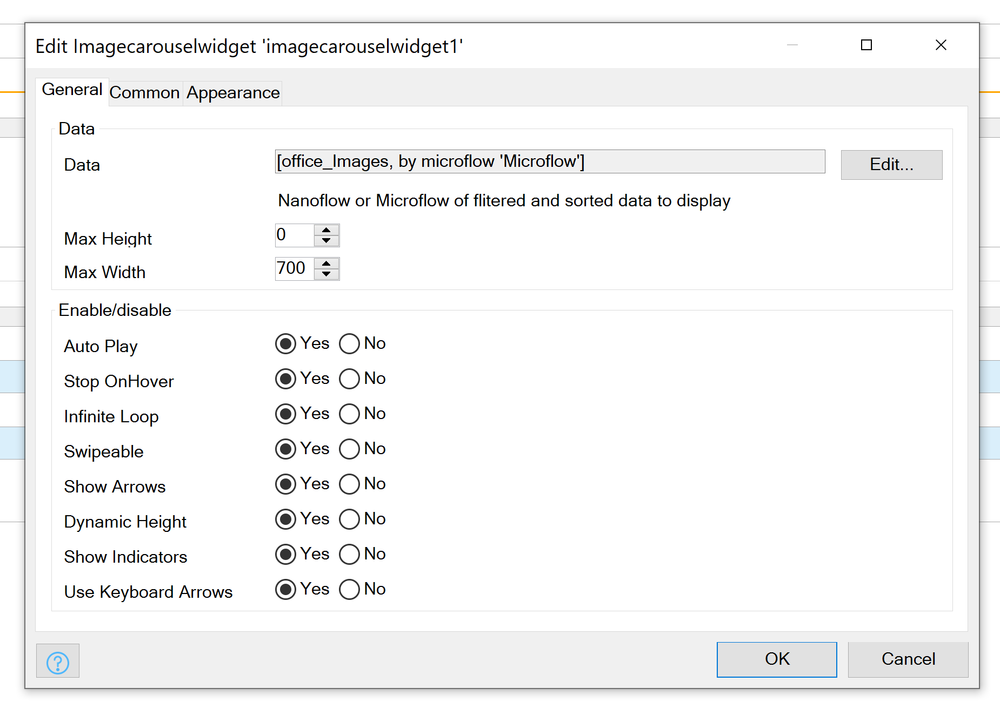

<h1 align="center">Image Carousel Widget (Mendix Widget)</h1>

  
  
  
  
  
  
   

 
   
   
  <h2 align="center">
    A Mendix Image Carousel Widget 
  </h2>
  <h5 align="center"> 
    Responsive and Customizable 
  </h5>

 
<h3>Usage</h3>

 

|                 | Type         | Info                                                                                 |
| --------------- | ------------ | ------------------------------------------------------------------------------------ |
| Data            | `datasource` | Datasource of Datamodel to display. Linked to a System Image in One to Many Relation |
| Max Height      | `number`     | Max height of the Container, Optimize this value for the Images you plan on using    |
| Max Width       | `number`     | Max Width of the Container, Optimize this value for the Images you plan on using     |
| Auto Play       | `boolean`    | Should Images Automatically Scroll                                                   |
| Stop on Hover   | `boolean`    | Should Stop Scroll on Hover over Image                                               |
| Infinite Loop   | `boolean`    | Should Images Scroll forever                                                         |
| Swipeable       | `boolean`    | Allow touch and track devices to scroll on Swipe                                     |
| Show Arrows     | `boolean`    | Display Next/Prev Arrows                                                             |
| Dynamic Height  | `boolean`    | Should Height be based on Image Height (use with caution with Max Height)            |
| Show Indicators | `boolean`    | Show Indicators Dots on Images                                                       |
| Keyboard Arrows | `boolean`    | Should Scroll be affected by Keyboard Arrows                                         |

 

<h4>Exposed Class Names</h4>

|                                       | Desc.                                                      |
| ------------------------------------- | ---------------------------------------------------------- |
| `Image-Carousel__Prev`                | Class Name on Prev Button                                  |
| `Image-Carousel__Next`                | Class Name on Next Button                                  |
| `Image-Carousel__Content`             | Class Name on Anything you place in the Content box        |
| `Image-Carousel__Content__INDEXNUMER` | Class Name on Everything in Content Box based in its Index |

 

**Note** - `Carousel__Content__INDEXNUMER` if there are 2 Images the first Image's class name will be
`Carousel__Content__0` the second `Carousel__Content__1`

 

<h4>Examples</h4>

 

 

 

